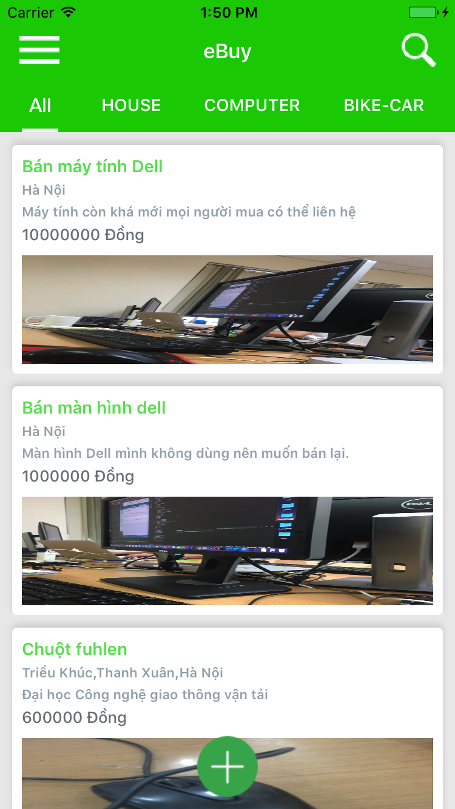
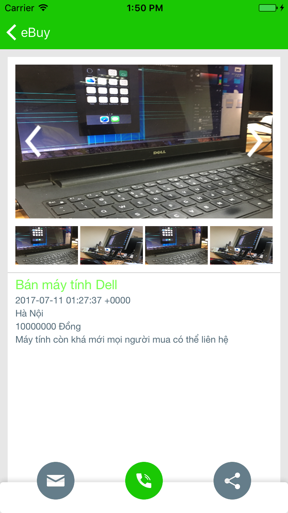
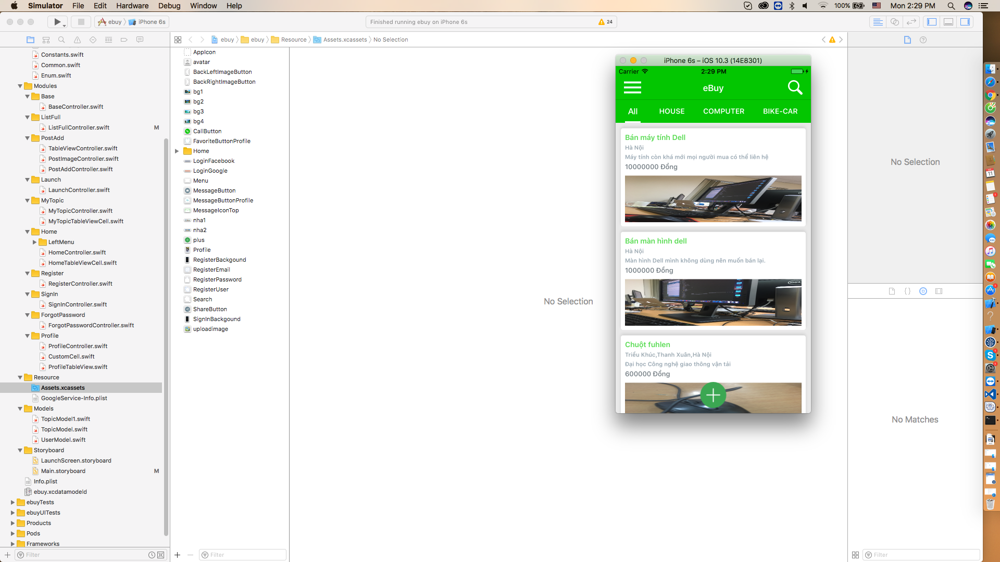

# ebuy





## Usage

1) Download the repository

```
$ git clone https://github.com/tuananh11594/ebuy.git
$ cd ebuy
```
    
2) Run `pod install`

```
$ pod install
```

3) Open the project in Xcode

```
$ open ebuy.xcworkspace
```

4) Compile and run the app in your simulator



# Requirements

- Xcode 7
- iOS 10
- Swift 3